# Parametric OpenScad Movement tray generator
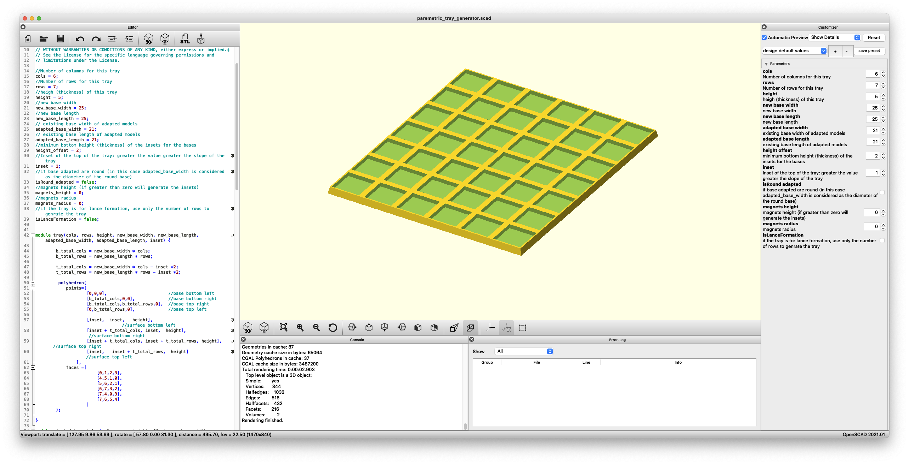

This is an [OpenScad](http://openscad.org/index.html) script that can generate a movement tray to adapt the Old school warhammer 20mm square base to the new Old World 25mm square base system.

The script is absolutely parametric and can generate a custom tray for rows/cols tray.

# How to use

You can use the script and run it with [OpenScad](http://openscad.org/index.html) desktop app.

You can also generate trays from cli, for example this command:

```openscad -o tray.stl -D "cols=6;rows=3;" paremetric_tray_generator.scad```

Will generate a tray with 6 cols and 3 rows calculated for default 25mm square base and 20mm insets, the tray will be 150x75 mm.

The script can also generate a tray to adapt round bases setting ```isRound_adapted``` to true (default is false)

If you use different values for width and lenght you can generate also adapters for cavalry

# Important notes

## Tolerance 

When setting the value for ```adapted_base_width```and ```adapted_base_length``` add 1mm of tolerance eg: set 21mm for an old 20mm square base. The final "fit" depends also on you printer settings and calibration.  

### Parameters

```cols```  Number of columns for this tray

```rows``` Number of rows for this tray

```height``` heigh (thickness) of the tray

```new_base_width```  new base width 

```new_base_length```  new base length  

```adapted_base_width``` existing base width of adapted models

```adapted_base_length``` existing base length of adapted models

```height_offset``` minimum bottom height (thickness) of the insets for the bases

```inset``` Inset of the top of the tray: greater the value greater the slope of the tray

```isRound_adapted``` if base adapted are round (in this case adapted_base_size is considered as the diameter of the round base)

```magnets_height``` magnets height (if greater than zero will generate the insets)

```magnets_radius``` magnets radius

```isLanceFormation``` if the tray is for lance formation, use only the number of ```rows``` to genrate the tray

```createEmptyMovementTray``` Create a standard (non an adpater) movement tray for given new_base_length x new_base_width

```markBases``` Put a mark to show the new base widh/length on the adapter

## What you can do with the script

[Here](paremetric_tray_generator.json) you can find a paremetric saved profiles file for openscad: place it in the same folder where you use the script, then you should see a list of profiles:

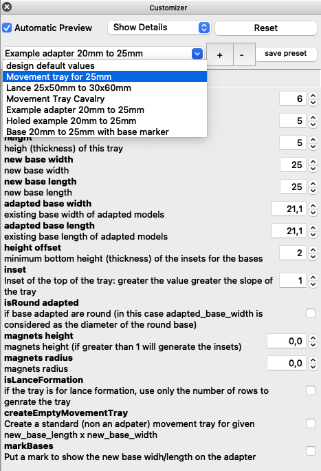

### Square 20mm to 25mm sample:

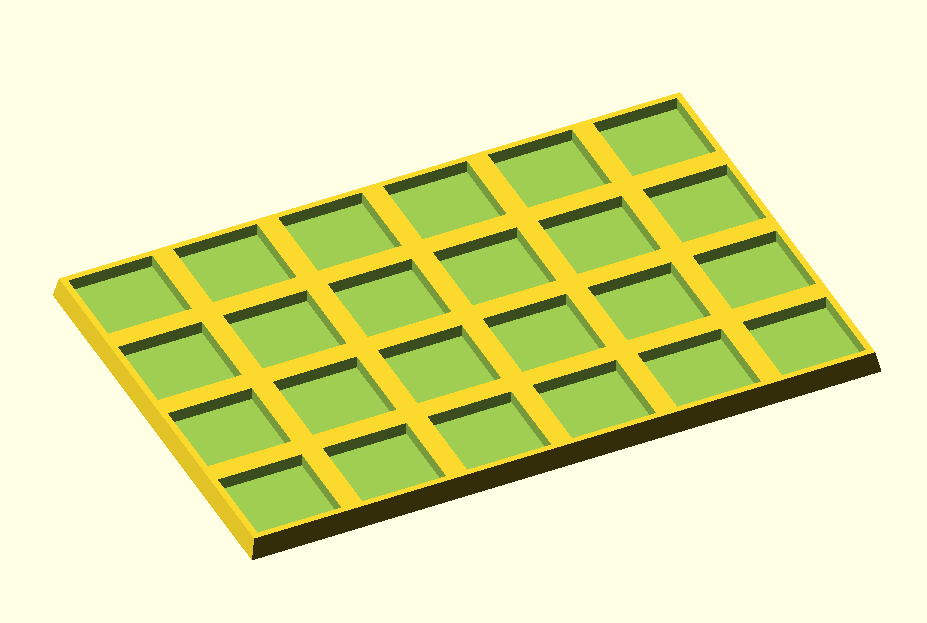

### Round 25mm to 25mm sample:

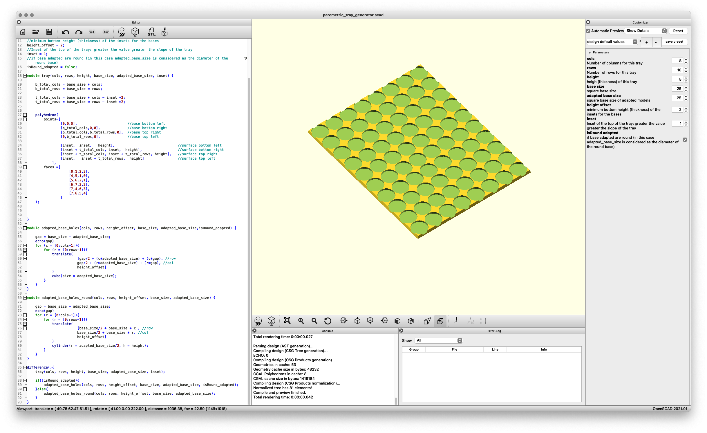

### Rectangular 25x50mm to 30x60mm sample:

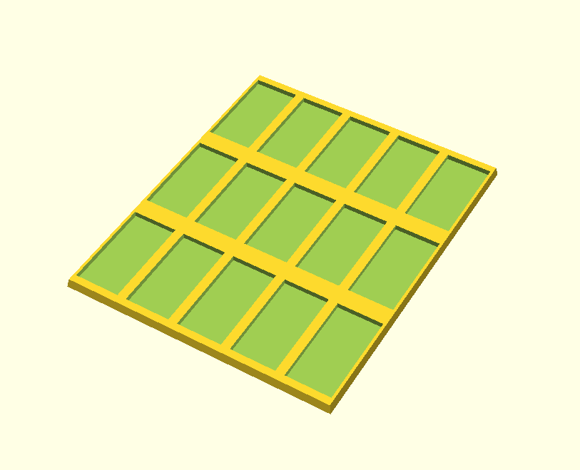

### Adapter with marked bases to identify better minis contact in combat

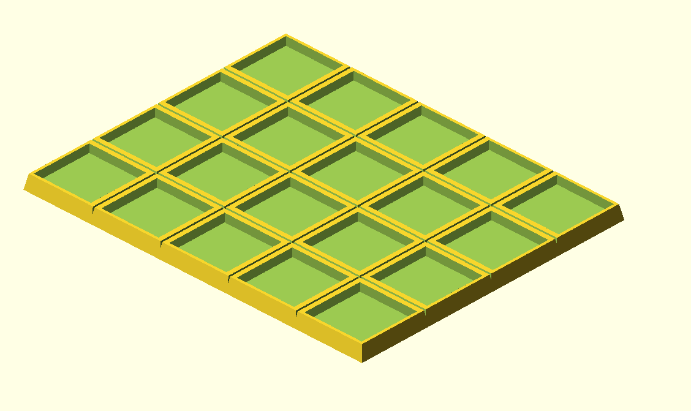

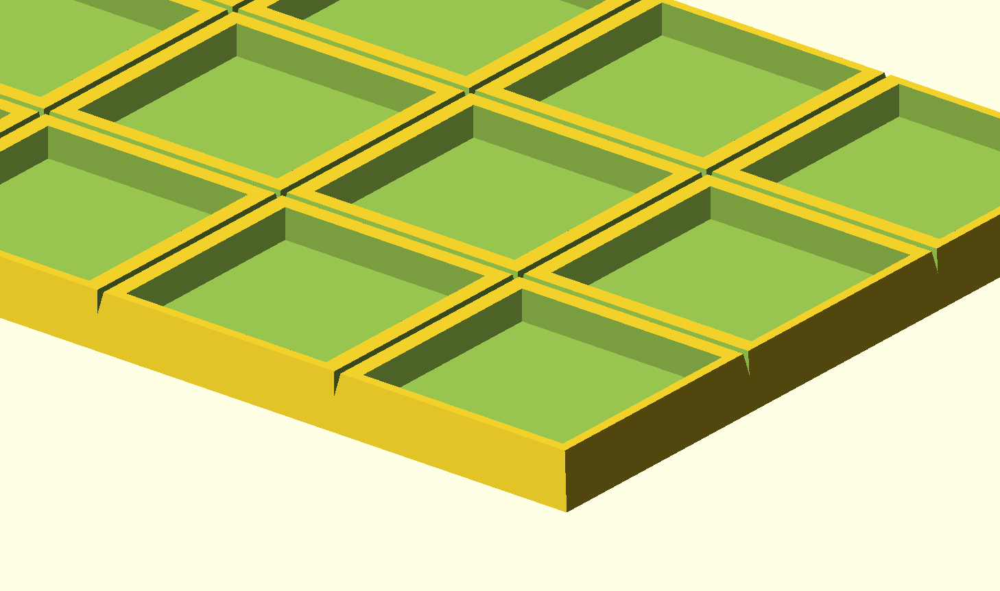


### Holed tray

This is particularly useful to glue a metal plate under the tray to use magnetized minis

To obtain it just use a negative number for ```height_offset``` like -1

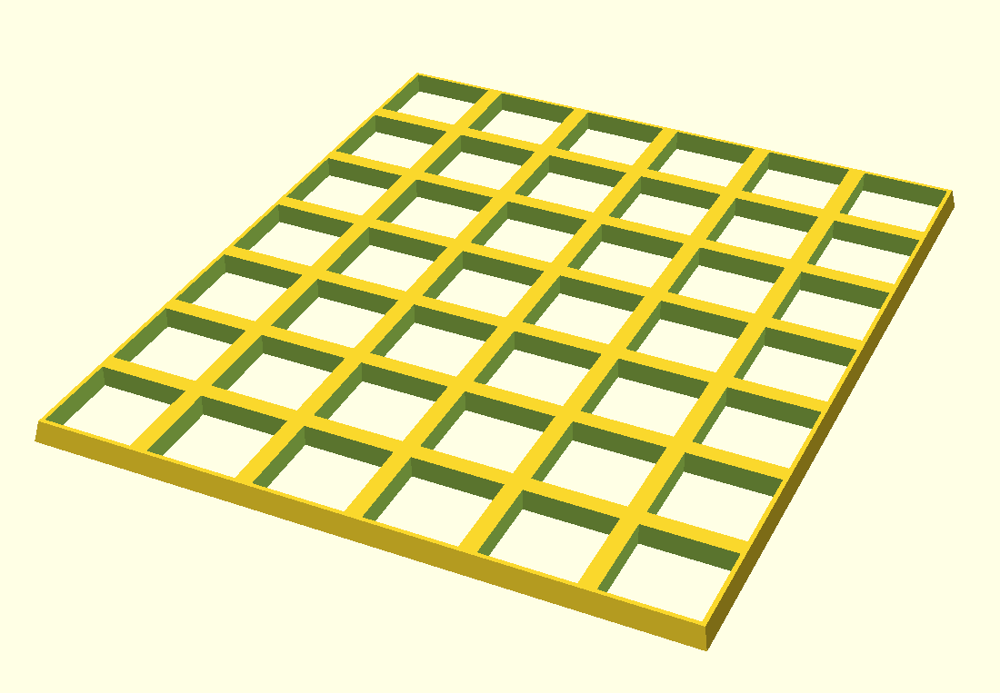

### Magnets 3x1mm insets

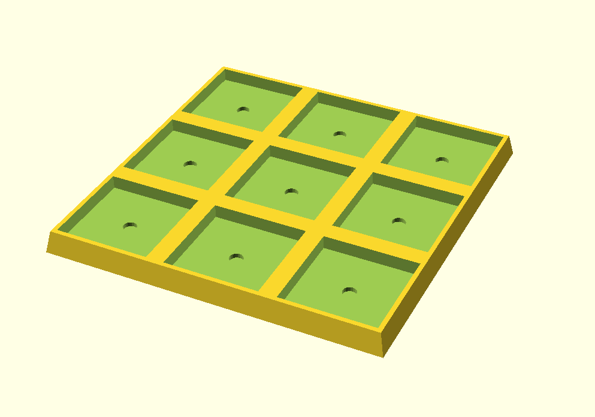

### Lance Formation

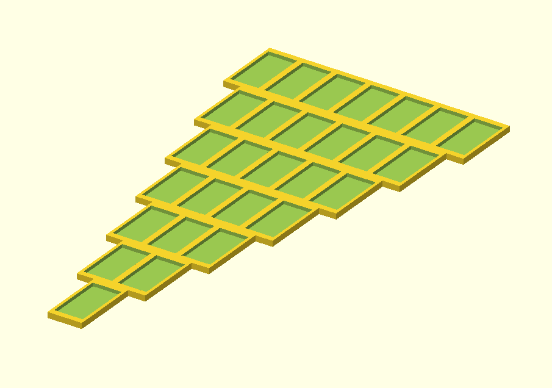

### Empty standard movement tray

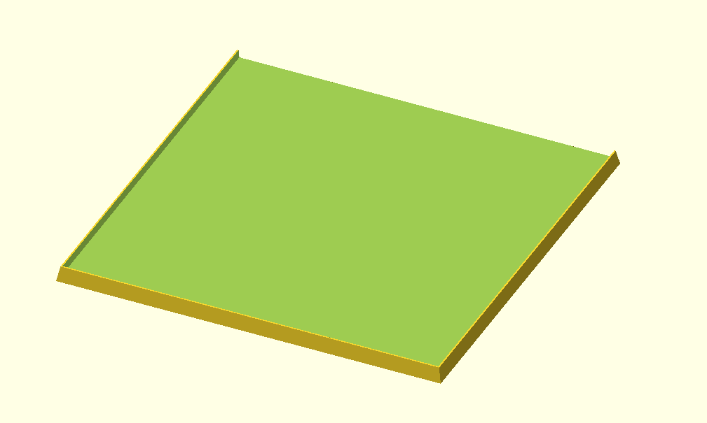

### Empty standard Lance movement tray

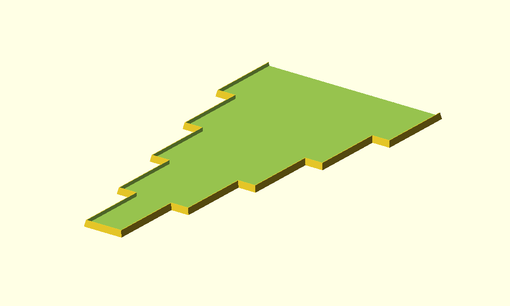


## License

Parametric OpenScad movement tray generator is under [Apache 2
license](http://www.apache.org/licenses/LICENSE-2.0.html).


