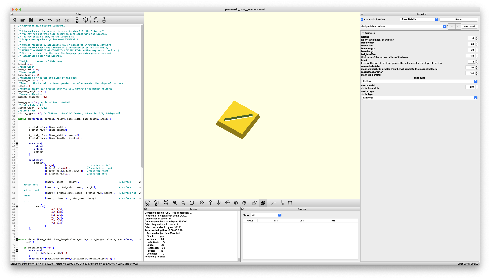
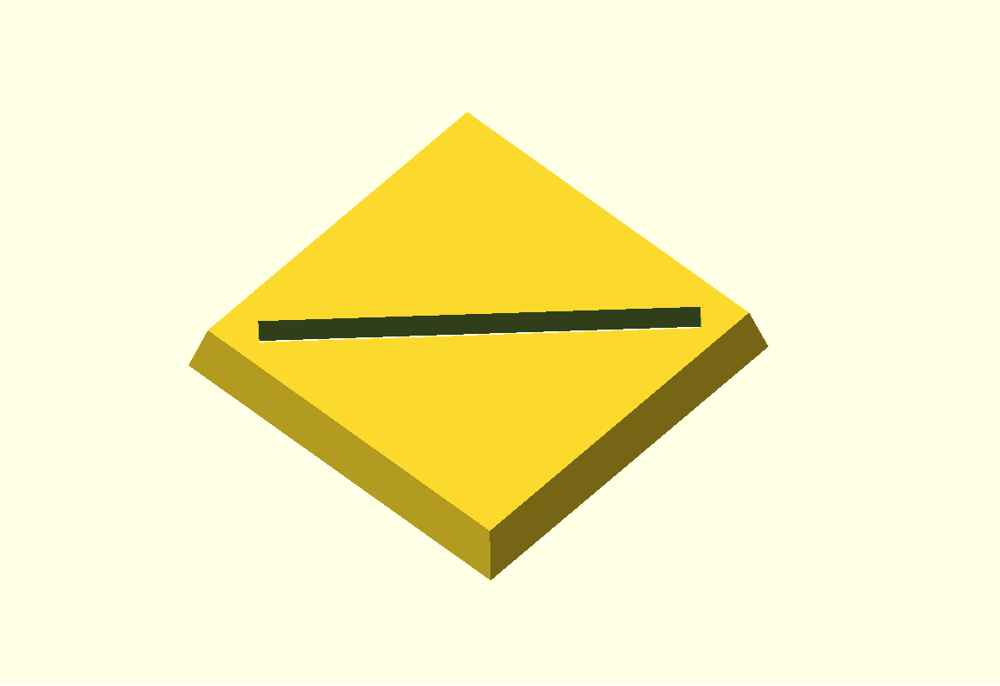
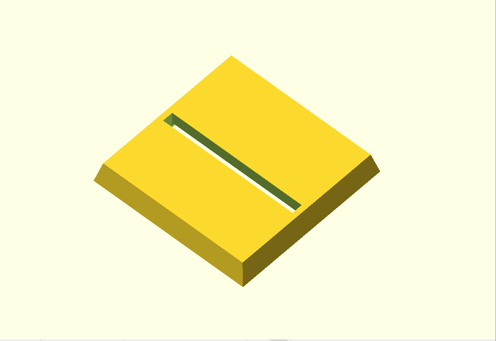
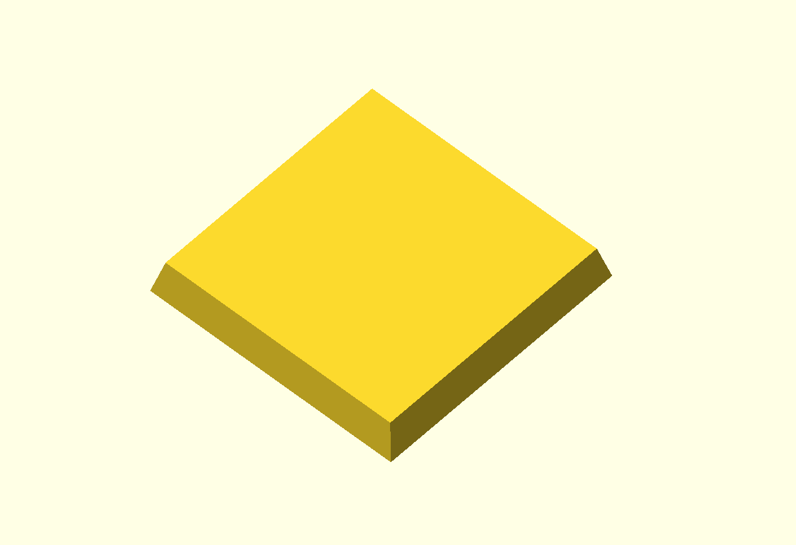

# Parametric OpenScad Bases generator

This is an [OpenScad](http://openscad.org/index.html) script that can generate square bases for Old school warhammer base system.

The script is absolutely parametric and can generate a custom square bases of any size (hollowed or solid) with slotta hole.

# Parameters

## Some example 

Slotta

Plain

